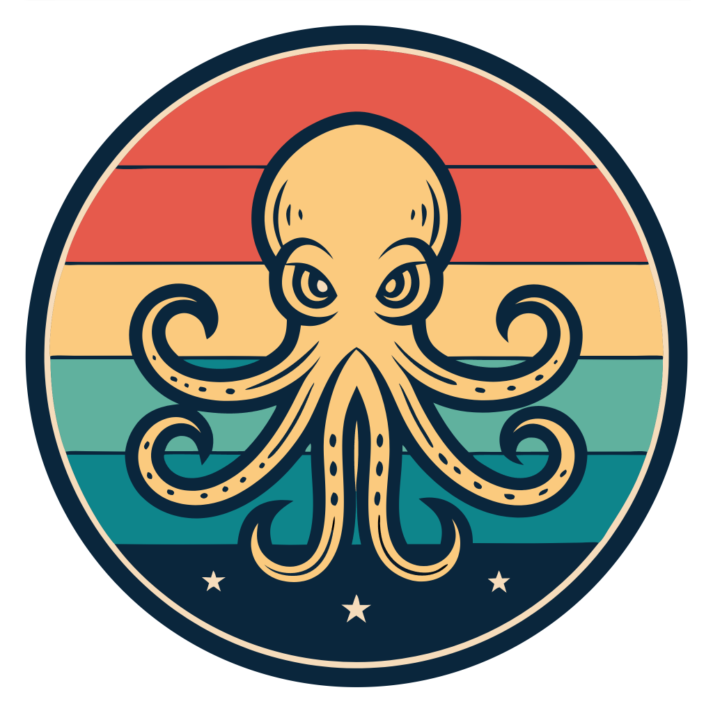

# Zooper.Octopus



[](https://www.nuget.org/packages/Zooper.Octopus/)
[](https://opensource.org/licenses/MIT)

Zooper.Octopus is a lightweight .NET library that simplifies the implementation of Hexagonal Architecture (Ports and Adapters) pattern in your applications. It provides a clean and intuitive way to define ports and automatically register their adapters in your dependency injection container.

## Key Features

- **Clean Architecture**: Implements the Hexagonal Architecture pattern with clear separation of concerns
- **Ports and Adapters**: Provides a clear way to define ports and their implementations
- **Dependency Injection**: Automatic registration of adapters in your DI container
- **Flexible Scanning**: Multiple ways to scan and register adapters from different assemblies
- **Minimal Dependencies**: Only depends on Microsoft.Extensions.DependencyInjection and Scrutor
- **Type-safe**: Leverages C#'s type system for robust port definitions
- **Testable**: Designed with testability in mind from the ground up

## Installation

```bash
dotnet add package Zooper.Octopus
```

## Quick Start

Here's a basic example of implementing Hexagonal Architecture with Zooper.Octopus:

```csharp
// Define your port (in your core/domain layer)
public interface IUserRepository : IPort
{
    Task<User?> GetByIdAsync(Guid id);
    Task SaveAsync(User user);
}

// Implement your adapter (in your infrastructure layer)
public class SqlUserRepository : IUserRepository
{
    private readonly DbContext _dbContext;

    public SqlUserRepository(DbContext dbContext)
    {
        _dbContext = dbContext;
    }

    public async Task<User?> GetByIdAsync(Guid id)
    {
        return await _dbContext.Users.FindAsync(id);
    }

    public async Task SaveAsync(User user)
    {
        _dbContext.Users.Update(user);
        await _dbContext.SaveChangesAsync();
    }
}

// Register adapters in your composition root
public class Startup
{
    public void ConfigureServices(IServiceCollection services)
    {
        // Register all adapters from the current assembly
        services.RegisterAdapters();

        // Or register adapters from specific assemblies
        services.RegisterAdapters(typeof(SqlUserRepository).Assembly);

        // Or register adapters from multiple assemblies
        services.RegisterAdapters(
            typeof(SqlUserRepository).Assembly,
            typeof(AnotherAdapter).Assembly
        );
    }
}
```

## Core Concepts

### Ports

Ports are interfaces that define the boundaries of your application. They represent the contracts that your application core expects to be fulfilled:

```csharp
public interface IEmailService : IPort
{
    Task SendEmailAsync(string to, string subject, string body);
}
```

### Adapters

Adapters are the implementations of ports. They live in the infrastructure layer and provide the actual functionality:

```csharp
public class SmtpEmailService : IEmailService
{
    private readonly SmtpClient _smtpClient;

    public SmtpEmailService(SmtpClient smtpClient)
    {
        _smtpClient = smtpClient;
    }

    public async Task SendEmailAsync(string to, string subject, string body)
    {
        var message = new MailMessage("noreply@example.com", to, subject, body);
        await _smtpClient.SendMailAsync(message);
    }
}
```

### Registration

Zooper.Octopus provides several ways to register your adapters:

```csharp
// Register all adapters from application dependencies
services.RegisterAdapters();

// Register adapters from a specific assembly
services.RegisterAdapters(typeof(SqlUserRepository).Assembly);

// Register adapters from multiple assemblies
services.RegisterAdapters(
    typeof(SqlUserRepository).Assembly,
    typeof(SmtpEmailService).Assembly
);

// Register adapters from the assembly containing a specific type
services.RegisterAdapters<SqlUserRepository>();
```

## Best Practices

### Port Organization

1. **Keep Ports Focused**: Each port should have a single responsibility
2. **Use Meaningful Names**: Port names should clearly indicate their purpose
3. **Define Clear Contracts**: Port interfaces should be well-defined and stable

### Adapter Implementation

1. **Keep Adapters Simple**: Adapters should focus on implementing the port contract
2. **Handle Dependencies**: Use constructor injection for dependencies
3. **Implement Error Handling**: Adapters should handle errors appropriately

### Testing

1. **Test Ports Independently**: Test ports without their adapters
2. **Mock Adapters**: Use mocks for testing the application core
3. **Test Adapters in Isolation**: Test adapters with their specific dependencies

## Examples

Check out the [Zooper.Octopus.Examples](./Zooper.Octopus.Examples) project for comprehensive examples including:

- User management system
- Email notification service
- File storage system
- Different adapter implementations

## Contributing

Contributions are welcome! Please feel free to submit a Pull Request.

## License

This project is licensed under the MIT License - see the [LICENSE](LICENSE) file for details.

## Related Projects

- [Zooper.Bee](https://github.com/zooper-lib/Bee) - Fluent workflow framework
- [Zooper.Fox](https://github.com/zooper-lib/Fox) - Functional programming primitives
